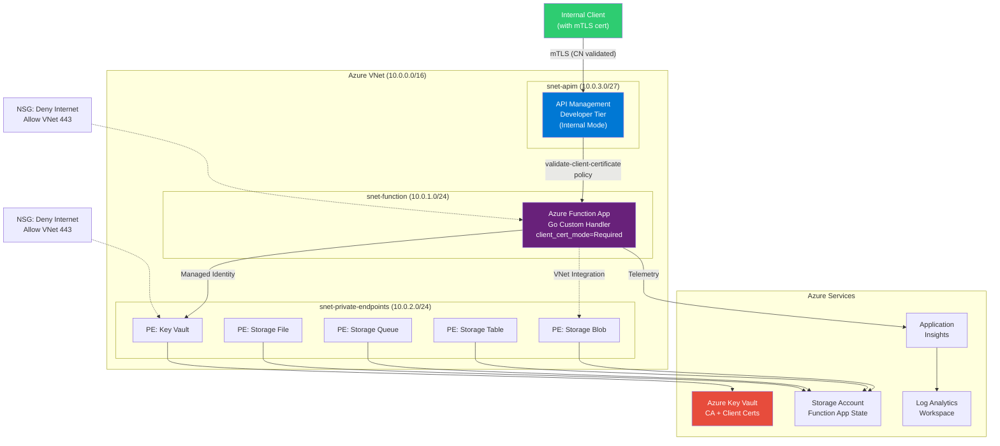

# Checkout.com Cloud Platform Engineering — Technical Assessment

Internal API deployment on Azure with Terraform, mTLS, observability, and CI/CD.

## Architecture Diagram



## Design Decisions

### Module Repository Strategy

**Production approach (recommended):** Each Terraform module lives in its own Git repository under a dedicated GitHub organisation (e.g., `checkout-terraform-modules/`):

- `terraform-azurerm-networking`
- `terraform-azurerm-function-app`
- `terraform-azurerm-api-management`
- `terraform-azurerm-observability`
- `terraform-azurerm-key-vault`
- `terraform-azurerm-certificates`

**Benefits:**
- Module development is decoupled from provisioning (implementation) code
- Git history is clean and readable — no dev code mixed with infra code
- Modules are versioned via Git tags and consumed as `source = "git::https://github.com/org/terraform-azurerm-networking.git?ref=v1.2.0"`
- Separate CI pipelines for module testing vs infrastructure provisioning
- Reusable across multiple projects and teams

**This assessment:** Uses a monorepo with local `./modules/` for pragmatic submission, but the structure is designed for easy extraction into separate repos.

### Remote State Architecture

**The chicken-and-egg problem:** Terraform needs a backend to store state, but that backend (Azure Storage Account) must itself be provisioned before Terraform can run.

**Solution:** A bootstrap script (`scripts/bootstrap-state.sh`) using Azure CLI:

1. Creates a Resource Group for state storage
2. Creates a Storage Account with blob versioning + 30-day soft-delete
3. Creates a blob container for tfstate files
4. Outputs the backend configuration for `providers.tf`

**Authentication options:**

| Option | Use Case | How |
|--------|----------|-----|
| **GitHub OIDC** | CI/CD-driven workflows | Azure AD app registration with federated credential for the GitHub repo. Secrets: `AZURE_CLIENT_ID`, `AZURE_SUBSCRIPTION_ID`, `AZURE_TENANT_ID` |
| **Local bootstrap** | Initial setup, strict secret management | `az login` on a trusted engineer's machine. No secrets stored in GitHub. |

### mTLS & Defense-in-Depth

Two layers of certificate validation protect against compromised internal services:

**Layer 1 — APIM Gateway:**
- `validate-client-certificate` XML policy checks issuer, subject CN, and expiry
- Even if a compromised service has VNet access, it needs a cert with CN `api-client.internal.checkout.com` signed by our CA

**Layer 2 — Function App (application level):**
- `client_certificate_mode = "Required"` enforced at platform level
- Go code validates the `X-ARR-ClientCert` header: decodes cert, verifies CA chain, checks CN
- Strict payload validation: `DisallowUnknownFields()`, max size, type checking

### Technology Choices

| Choice | Rationale |
|--------|-----------|
| Go custom handler | Systems engineering signal; performant; type-safe |
| APIM Developer tier | Full VNet injection (`Internal` mode); native mTLS policy; enterprise pattern |
| UK South region | Checkout.com is UK-based |
| tfvars (not workspaces) | Explicit, readable environment separation |
| Consumption plan (Y1) | Cost-effective for assessment; production would use Premium for always-on VNet |

## Setup & Deployment

### Prerequisites

- [Terraform](https://terraform.io) >= 1.6.0
- [Go](https://golang.org) >= 1.22
- [Azure CLI](https://docs.microsoft.com/en-us/cli/azure/) >= 2.50
- An Azure subscription

### 1. Bootstrap State Backend

```bash
az login
./scripts/bootstrap-state.sh
# Follow the output to update providers.tf with the backend block
```

### 2. Build the Go Function

```bash
cd function-app
GOOS=linux GOARCH=amd64 go build -o handler .
```

### 3. Deploy Infrastructure

```bash
# Set your subscription ID
export TF_VAR_subscription_id="your-subscription-id"

terraform init
terraform plan -var-file=environments/dev.tfvars
terraform apply -var-file=environments/dev.tfvars
```

### 4. Verify Deployment

```bash
# From within the VNet (bastion/jumpbox):
./scripts/test-api.sh \
  https://apim-checkout-dev.azure-api.net \
  ./certs/client.pem \
  ./certs/client-key.pem \
  ./certs/ca.pem
```

Or use the APIM Developer tier test console in Azure Portal.

## Testing

### Go Unit Tests

```bash
cd function-app
go test -v -race ./...
```

### Terraform Native Tests

```bash
terraform test
```

### Terratest Integration Tests

```bash
cd tests
go test -v -timeout 60m ./...
```

### Quality Checks

```bash
# Terraform
terraform fmt -check -recursive
terraform validate
tflint --recursive
trivy config .
checkov -d .

# Go
cd function-app
golangci-lint run
go vet ./...
```

## Teardown

```bash
terraform destroy -var-file=environments/dev.tfvars
```

**Manual steps:**
- Key Vault with purge protection requires manual purge after the soft-delete retention period (7 days)
- If bootstrap state backend is no longer needed: `az group delete --name rg-tfstate-uksouth`

## OIDC Configuration for GitHub Actions

GitHub Actions authenticates to Azure using OpenID Connect (OIDC) — no long-lived secrets are stored. Instead, GitHub requests a short-lived token from Azure AD using a federated identity credential that trusts the GitHub OIDC provider.

### Step 1: Create an Azure AD App Registration

This is the identity that GitHub Actions will authenticate as.

```bash
az ad app create --display-name "github-actions-checkout-platform" \
  --query "{appId:appId, objectId:id}" -o json
```

Save the `appId` (client ID) and `objectId` (needed for federated credential commands).

### Step 2: Create Federated Credentials

Federated credentials tell Azure AD which GitHub workflows are allowed to authenticate as this app. Each credential is scoped to a specific trigger type — this prevents unauthorized repos or workflows from impersonating the identity.

**For pushes to `main` and tagged releases:**

```bash
az ad app federated-credential create \
  --id <APP_OBJECT_ID> \
  --parameters '{
    "name": "github-main",
    "issuer": "https://token.actions.githubusercontent.com",
    "subject": "repo:ko5tas/checkout.com_interview:ref:refs/heads/main",
    "audiences": ["api://AzureADTokenExchange"]
  }'
```

Why: The Terraform CI workflow runs on pushes to `main`, and the release workflow triggers on `v*` tags (which resolve to the main branch). Both need this credential.

**For pull requests** (Terraform Plan):

```bash
az ad app federated-credential create \
  --id <APP_OBJECT_ID> \
  --parameters '{
    "name": "github-pr",
    "issuer": "https://token.actions.githubusercontent.com",
    "subject": "repo:ko5tas/checkout.com_interview:pull_request",
    "audiences": ["api://AzureADTokenExchange"]
  }'
```

Why: The `terraform plan` job runs on PRs to show infrastructure changes before merging. Without this credential, PR workflows can't authenticate to Azure.

### Step 3: Create a Service Principal and Assign Roles

The app registration is an identity — the service principal makes it usable in Azure RBAC, and the role assignment grants it permissions.

```bash
# Create the service principal (makes the app usable in Azure RBAC)
az ad sp create --id <APP_ID>

# Grant Contributor on the target subscription
az role assignment create \
  --assignee <APP_ID> \
  --role Contributor \
  --scope /subscriptions/<SUBSCRIPTION_ID>
```

Why Contributor: Terraform needs to create, modify, and delete resources. Contributor grants this without allowing role assignment changes (which would require Owner). For production, consider a custom role with only the specific permissions needed.

### Step 4: Set GitHub Repository Secrets

These secrets are referenced in the workflow files via `${{ secrets.AZURE_CLIENT_ID }}` etc. They are never exposed in logs.

```bash
gh secret set AZURE_CLIENT_ID --body "<APP_ID>"
gh secret set AZURE_SUBSCRIPTION_ID --body "<SUBSCRIPTION_ID>"
gh secret set AZURE_TENANT_ID --body "<TENANT_ID>"
```

| Secret | What It Is | Where It Comes From |
|--------|-----------|-------------------|
| `AZURE_CLIENT_ID` | App registration's Application (client) ID | `az ad app create` output |
| `AZURE_SUBSCRIPTION_ID` | Target Azure subscription | `az account show --query id` |
| `AZURE_TENANT_ID` | Azure AD tenant | `az account show --query tenantId` |

### How OIDC Works in the Workflow

```yaml
# The workflow requests a token from Azure AD
- uses: azure/login@v2
  with:
    client-id: ${{ secrets.AZURE_CLIENT_ID }}
    tenant-id: ${{ secrets.AZURE_TENANT_ID }}
    subscription-id: ${{ secrets.AZURE_SUBSCRIPTION_ID }}
```

GitHub sends its OIDC token to Azure AD → Azure AD validates the token against the federated credential (checking issuer, subject, audience) → Azure AD issues a short-lived access token → Terraform uses that token via `ARM_USE_OIDC=true`.

### Teardown

To remove the OIDC configuration:

```bash
# Delete the app registration (also removes SP and federated credentials)
az ad app delete --id <APP_ID>

# Remove GitHub secrets
gh secret delete AZURE_CLIENT_ID
gh secret delete AZURE_SUBSCRIPTION_ID
gh secret delete AZURE_TENANT_ID
```

## Assumptions

- **Azure Entra ID (identity) setup is simplified** — a single app registration with Contributor on the default subscription. Production would implement a proper Entra ID design: dedicated subscriptions per environment, custom RBAC roles scoped to specific resource groups, separate app registrations per workflow, and Entra ID groups for access governance. This was a conscious time/complexity trade-off for the assessment.
- Self-signed certificates only; no custom domain or commercial certificates purchased
- APIM Developer tier for full mTLS and VNet injection (production would evaluate Premium tier)
- Function App Consumption plan (Y1) for cost; Premium plan needed for always-on VNet integration in production
- Single region (UK South); multi-region not in scope
- Remote state documented but not pre-provisioned (run `bootstrap-state.sh` first)
- Python/Node/Java alternatives considered; Go chosen for type safety and performance
- `authLevel: "anonymous"` on Function App HTTP trigger because authentication is handled by mTLS at both APIM and Function App layers

## Estimated Azure Costs

| Resource | Monthly Cost |
|----------|-------------|
| Function App (Consumption Y1) | ~$0 (1M free executions) |
| APIM Developer tier | ~$50 |
| Storage Account (LRS) | ~$1 |
| Key Vault | ~$0.03/10K operations |
| Log Analytics (5GB free) | ~$0 |
| Application Insights (5GB free) | ~$0 |
| Private Endpoints (x5) | ~$37.50 ($7.50 each) |
| **Total** | **~$90-100/month** |

> Destroy resources promptly after assessment review to minimise costs.

## AI Usage & Critique

This implementation was built with Claude (Anthropic) as an AI coding assistant. Below is a summary of the collaboration and critique.

### Prompts Used

1. "Given the technical assessment PDF, let's start addressing each issue and build a SKILL.md library"
2. Iterative design discussions on: module repo strategy, remote state bootstrap, mTLS CN validation, payload validation, quality tooling (Trivy vs tfsec vs Checkov), testing frameworks (terraform test vs Terratest), and API demo approaches

### Critique of AI Output

**What worked well:**
- Comprehensive module structure following HashiCorp naming conventions
- Defense-in-depth mTLS approach (APIM + Function App level validation)
- Quality toolchain selection (identified tfsec deprecation in favour of Trivy)
- Circular dependency detection between observability and function-app modules

**Issues identified and corrected:**
- Initial suggestion used APIM Consumption tier which doesn't support `virtual_network_type = "Internal"` — corrected to Developer tier after discussion
- Initial Python suggestion changed to Go after user preference — this was a better choice for the systems engineering context
- `metric` block in diagnostic settings was deprecated in azurerm v4.x — caught by `terraform validate` and corrected to `enabled_metric`
- `azurerm_key_vault_certificate` was initially planned but `azurerm_key_vault_secret` is correct for PEM content from the `tls` provider

**Patterns to watch for:**
- AI may default to the simplest/cheapest tier without considering functional requirements (e.g., Consumption APIM lacks VNet injection)
- AI-generated Terraform may use deprecated attributes — always run `terraform validate` and review warnings
- Module dependency graphs need manual review for circular references
