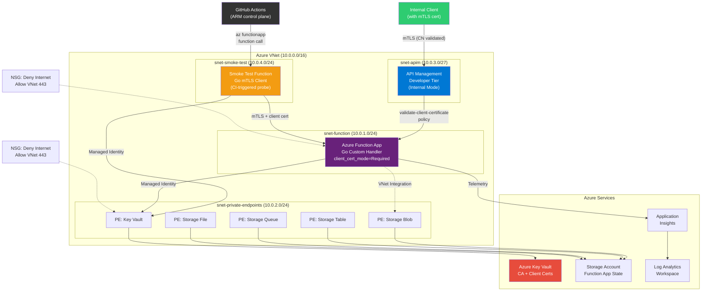

# Checkout.com Cloud Platform Engineering — Technical Assessment

Internal API deployment on Azure with Terraform, mTLS, observability, and CI/CD.

## Architecture Diagram



## VNet-Internal Smoke Testing with mTLS

The API runs on a private network and requires mTLS, making it unreachable from GitHub Actions runners on the public internet. We solve this with a **split-plane testing** pattern:

```
GitHub Runner (public internet)
  → az functionapp keys list (ARM control plane — always reachable)
  → curl https://smoke-func.azurewebsites.net/api/smoketest?code=<key>
    → Smoke Test Function (snet-smoke-test, inside VNet)
      1. Fetches client cert + key from Key Vault (Managed Identity + RBAC)
      2. Makes HTTPS POST with mTLS to main function's private endpoint
      3. Validates: HTTP 200, response body schema, X-Request-ID header
      → Returns structured JSON with pass/fail per test case
  → GitHub Runner reads result, fails the pipeline if any test fails
```

**What this proves:**
- VNet connectivity (smoke-test subnet → function subnet via private endpoint)
- Private DNS resolution (privatelink.azurewebsites.net)
- Key Vault RBAC + Managed Identity (cert retrieval)
- mTLS handshake (client cert CN validation)
- Go handler logic (payload processing, response format)
- End-to-end latency under real network conditions

**Cost:** ~$0/month (Consumption Y1 plan, only runs when CI triggers it)

**Alternatives considered:**
- Azure Container Instance (ACI): ephemeral but awkward VNet/DNS integration
- Self-hosted runner in VNet: ~$15/month, overkill for this assessment
- Azure Bastion: ~$140/month, far too expensive

## Design Decisions

### Module Repository Strategy

**Production approach (recommended):** Each Terraform module lives in its own Git repository under a dedicated GitHub organisation (e.g., `checkout-terraform-modules/`):

- `terraform-azurerm-networking`
- `terraform-azurerm-function-app`
- `terraform-azurerm-api-management`
- `terraform-azurerm-observability`
- `terraform-azurerm-key-vault`
- `terraform-azurerm-certificates`

**Benefits:**
- Module development is decoupled from provisioning (implementation) code
- Git history is clean and readable — no dev code mixed with infra code
- Modules are versioned via Git tags and consumed as `source = "git::https://github.com/org/terraform-azurerm-networking.git?ref=v1.2.0"`
- Separate CI pipelines for module testing vs infrastructure provisioning
- Reusable across multiple projects and teams

**This assessment:** Uses a monorepo with local `./modules/` for pragmatic submission, but the structure is designed for easy extraction into separate repos.

### Remote State Architecture

**The chicken-and-egg problem:** Terraform needs a backend to store state, but that backend (Azure Storage Account) must itself be provisioned before Terraform can run.

**Solution:** A bootstrap script (`scripts/bootstrap-state.sh`) using Azure CLI:

1. Creates a Resource Group for state storage
2. Creates a Storage Account with blob versioning + 30-day soft-delete
3. Creates a blob container for tfstate files
4. Outputs the backend configuration for `providers.tf`

**Authentication options:**

| Option | Use Case | How |
|--------|----------|-----|
| **GitHub OIDC** | CI/CD-driven workflows | Azure AD app registration with federated credential for the GitHub repo. Secrets: `AZURE_CLIENT_ID`, `AZURE_SUBSCRIPTION_ID`, `AZURE_TENANT_ID` |
| **Local bootstrap** | Initial setup, strict secret management | `az login` on a trusted engineer's machine. No secrets stored in GitHub. |

### mTLS & Defense-in-Depth

Two layers of certificate validation protect against compromised internal services:

**Layer 1 — APIM Gateway:**
- `validate-client-certificate` XML policy checks issuer, subject CN, and expiry
- Even if a compromised service has VNet access, it needs a cert with CN `api-client.internal.checkout.com` signed by our CA

**Layer 2 — Function App (application level):**
- `client_certificate_mode = "Required"` enforced at platform level
- Go code validates the `X-ARR-ClientCert` header: decodes cert, verifies CA chain, checks CN
- Strict payload validation: `DisallowUnknownFields()`, max size, type checking

### Technology Choices

| Choice | Rationale |
|--------|-----------|
| Go custom handler | Systems engineering signal; performant; type-safe |
| APIM Developer tier | Full VNet injection (`Internal` mode); native mTLS policy; enterprise pattern |
| West Europe region | Originally UK South (Checkout.com is UK-based); migrated due to free-trial quota limitations — see Decision Log #4 |
| tfvars (not workspaces) | Explicit, readable environment separation |
| Consumption plan (Y1) | Cost-effective for assessment; production would use Premium for always-on VNet |

## Setup & Deployment

### Prerequisites

- [Terraform](https://terraform.io) >= 1.6.0
- [Go](https://golang.org) >= 1.22
- [Azure CLI](https://docs.microsoft.com/en-us/cli/azure/) >= 2.50
- An Azure subscription

### 1. Bootstrap State Backend

```bash
az login
./scripts/bootstrap-state.sh
# Follow the output to update providers.tf with the backend block
```

### 2. Build the Go Function

```bash
cd function-app
GOOS=linux GOARCH=amd64 go build -o handler .
```

### 3. Deploy Infrastructure

```bash
# Set your subscription ID
export TF_VAR_subscription_id="your-subscription-id"

terraform init
terraform plan -var-file=environments/dev.tfvars
terraform apply -var-file=environments/dev.tfvars
```

### 4. Verify Deployment

```bash
# From within the VNet (bastion/jumpbox):
./scripts/test-api.sh \
  https://apim-checkout-dev.azure-api.net \
  ./certs/client.pem \
  ./certs/client-key.pem \
  ./certs/ca.pem
```

Or use the APIM Developer tier test console in Azure Portal.

## Testing

### Go Unit Tests

```bash
cd function-app
go test -v -race ./...
```

### Terraform Native Tests

```bash
terraform test
```

### Terratest Integration Tests

```bash
cd tests
go test -v -timeout 60m ./...
```

### Quality Checks

```bash
# Terraform
terraform fmt -check -recursive
terraform validate
tflint --recursive
trivy config .
checkov -d .

# Go
cd function-app
golangci-lint run
go vet ./...
```

## Teardown

```bash
terraform destroy -var-file=environments/dev.tfvars
```

**Manual steps:**
- Key Vault with purge protection requires manual purge after the soft-delete retention period (7 days)
- If bootstrap state backend is no longer needed: `az group delete --name rg-tfstate-uksouth`

## OIDC Configuration for GitHub Actions

GitHub Actions authenticates to Azure using OpenID Connect (OIDC) — no long-lived secrets are stored. Instead, GitHub requests a short-lived token from Azure AD using a federated identity credential that trusts the GitHub OIDC provider.

### Step 1: Create an Azure AD App Registration

This is the identity that GitHub Actions will authenticate as.

```bash
az ad app create --display-name "github-actions-checkout-platform" \
  --query "{appId:appId, objectId:id}" -o json
```

Save the `appId` (client ID) and `objectId` (needed for federated credential commands).

### Step 2: Create Federated Credentials

Federated credentials tell Azure AD which GitHub workflows are allowed to authenticate as this app. Each credential is scoped to a specific trigger type — this prevents unauthorized repos or workflows from impersonating the identity.

**For pushes to `main` and tagged releases:**

```bash
az ad app federated-credential create \
  --id <APP_OBJECT_ID> \
  --parameters '{
    "name": "github-main",
    "issuer": "https://token.actions.githubusercontent.com",
    "subject": "repo:ko5tas/checkout.com_interview:ref:refs/heads/main",
    "audiences": ["api://AzureADTokenExchange"]
  }'
```

Why: The Terraform CI workflow runs on pushes to `main`, and the release workflow triggers on `v*` tags (which resolve to the main branch). Both need this credential.

**For pull requests** (Terraform Plan):

```bash
az ad app federated-credential create \
  --id <APP_OBJECT_ID> \
  --parameters '{
    "name": "github-pr",
    "issuer": "https://token.actions.githubusercontent.com",
    "subject": "repo:ko5tas/checkout.com_interview:pull_request",
    "audiences": ["api://AzureADTokenExchange"]
  }'
```

Why: The `terraform plan` job runs on PRs to show infrastructure changes before merging. Without this credential, PR workflows can't authenticate to Azure.

### Step 3: Create a Service Principal and Assign Roles

The app registration is an identity — the service principal makes it usable in Azure RBAC, and the role assignment grants it permissions.

```bash
# Create the service principal (makes the app usable in Azure RBAC)
az ad sp create --id <APP_ID>

# Grant Contributor on the target subscription
az role assignment create \
  --assignee <APP_ID> \
  --role Contributor \
  --scope /subscriptions/<SUBSCRIPTION_ID>
```

Why Contributor: Terraform needs to create, modify, and delete resources. Contributor grants this without allowing role assignment changes (which would require Owner). For production, consider a custom role with only the specific permissions needed.

### Step 4: Set GitHub Repository Secrets

These secrets are referenced in the workflow files via `${{ secrets.AZURE_CLIENT_ID }}` etc. They are never exposed in logs.

```bash
gh secret set AZURE_CLIENT_ID --body "<APP_ID>"
gh secret set AZURE_SUBSCRIPTION_ID --body "<SUBSCRIPTION_ID>"
gh secret set AZURE_TENANT_ID --body "<TENANT_ID>"
```

| Secret | What It Is | Where It Comes From |
|--------|-----------|-------------------|
| `AZURE_CLIENT_ID` | App registration's Application (client) ID | `az ad app create` output |
| `AZURE_SUBSCRIPTION_ID` | Target Azure subscription | `az account show --query id` |
| `AZURE_TENANT_ID` | Azure AD tenant | `az account show --query tenantId` |

### Step 5: (Optional) Set Gemini API Key for AI Features

The deploy pipeline and weekly AI advisor use Google Gemini (free tier) for plan risk analysis and codebase improvement suggestions. Without this key, those steps gracefully degrade to deterministic-only analysis.

1. Go to [aistudio.google.com](https://aistudio.google.com) → "Get API key" → "Create API key"
2. Free tier: 15 requests/minute, 1M tokens/day — more than sufficient for CI/CD use
3. Set it as a GitHub secret:

```bash
gh secret set GEMINI_API_KEY --body "<YOUR_GEMINI_API_KEY>"
```

| Secret | What It Is | Where It Comes From |
|--------|-----------|-------------------|
| `GEMINI_API_KEY` | Google Gemini API key | [aistudio.google.com](https://aistudio.google.com) |

**What it powers:**
- `deploy.yml` → AI Plan Analysis job: natural-language risk summary of terraform plan changes
- `ai-advisor.yml` → Weekly codebase review: dependency updates, security advisories, architecture improvements

### How OIDC Works in the Workflow

```yaml
# The workflow requests a token from Azure AD
- uses: azure/login@v2
  with:
    client-id: ${{ secrets.AZURE_CLIENT_ID }}
    tenant-id: ${{ secrets.AZURE_TENANT_ID }}
    subscription-id: ${{ secrets.AZURE_SUBSCRIPTION_ID }}
```

GitHub sends its OIDC token to Azure AD → Azure AD validates the token against the federated credential (checking issuer, subject, audience) → Azure AD issues a short-lived access token → Terraform uses that token via `ARM_USE_OIDC=true`.

### Teardown

To remove the OIDC configuration:

```bash
# Delete the app registration (also removes SP and federated credentials)
az ad app delete --id <APP_ID>

# Remove GitHub secrets
gh secret delete AZURE_CLIENT_ID
gh secret delete AZURE_SUBSCRIPTION_ID
gh secret delete AZURE_TENANT_ID
```

## Assumptions

- **Azure Entra ID (identity) setup is simplified** — a single app registration with Contributor on the default subscription. Production would implement a proper Entra ID design: dedicated subscriptions per environment, custom RBAC roles scoped to specific resource groups, separate app registrations per workflow, and Entra ID groups for access governance. This was a conscious time/complexity trade-off for the assessment.
- Self-signed certificates only; no custom domain or commercial certificates purchased
- APIM Developer tier for full mTLS and VNet injection (production would evaluate Premium tier)
- Function App Consumption plan (Y1) for cost; Premium plan needed for always-on VNet integration in production
- Single region (West Europe); multi-region not in scope
- Remote state documented but not pre-provisioned (run `bootstrap-state.sh` first)
- Python/Node/Java alternatives considered; Go chosen for type safety and performance
- `authLevel: "anonymous"` on Function App HTTP trigger because authentication is handled by mTLS at both APIM and Function App layers
- **Centralised Entra ID RBAC for Key Vault** — Key Vault uses `enable_rbac_authorization = true` with Azure RBAC role assignments instead of vault-local access policies. This centralises all authN/authZ through Entra ID, enabling Conditional Access, PIM, unified audit logs, and Management Group policy enforcement.
- **Storage account still uses shared keys** — Azure Functions Consumption (Y1) plan on Linux **requires** `storage_account_access_key` for `AzureWebJobsStorage`; Managed Identity-based storage access is only supported on Elastic Premium (EP1+) and Dedicated plans. This is a known Microsoft limitation. Production would upgrade to EP1+ and use Managed Identity with `Storage Blob Data Owner` role for full Entra ID centralisation.
- **Future improvements for full Entra ID centralisation:**
  - Migrate to Elastic Premium plan to enable Managed Identity for Function App storage
  - Implement Entra ID groups for RBAC role assignments (e.g., `Platform-Engineers` group → `Key Vault Administrator`)
  - Add Management Groups to enforce policies across subscriptions (e.g., deny legacy access policy model)
  - Enable Privileged Identity Management (PIM) for JIT elevation to sensitive roles
  - Configure Conditional Access policies requiring MFA for Key Vault data plane access

## Estimated Azure Costs

| Resource | Monthly Cost |
|----------|-------------|
| Function App — main (Consumption Y1) | ~$0 (1M free executions) |
| Function App — smoke test (Consumption Y1) | ~$0 (runs only during CI) |
| APIM Developer tier | ~$50 |
| Storage Account — main (LRS) | ~$1 |
| Storage Account — smoke test (LRS) | ~$1 |
| Key Vault | ~$0.03/10K operations |
| Log Analytics (5GB free) | ~$0 |
| Application Insights (5GB free) | ~$0 |
| Private Endpoints (x5) | ~$37.50 ($7.50 each) |
| **Total** | **~$90-100/month** |

> Destroy resources promptly after assessment review to minimise costs.

### Cost Control: Decision Log

1. **Free Trial spending limit blocked provisioning.** Azure Free Trial subscriptions have a spending limit that prevents creating Consumption plan (Dynamic VM) resources — Azure returns a misleading `401 Unauthorized` / `Dynamic VMs quota: 0` error. The fix was upgrading the subscription from Free Trial to Pay-As-You-Go, which removed the spending limit while preserving the remaining £147.77 credit.

2. **Budget set to exact remaining credits.** We created an Azure budget (`free-trial-guard`) set to £147.77 with email notifications at 80% and 100% thresholds via the Cost Management REST API. This prevents silent overspend.

3. **Daily Budget Guard workflow** (`budget-guard.yml`). Runs daily at 07:23 UTC and checks two conditions:
   - **Credit expiry date** — configured via `CREDIT_EXPIRY_DATE` repo variable (set to 2026-04-16, matching Azure portal credit expiry)
   - **Cumulative spend** — queries the Cost Management API and compares against the budget amount

   If either condition is true, the workflow automatically:
   - Destroys all dev infrastructure (`terraform destroy`)
   - Sets the budget to £0.01 (Azure minimum)
   - Cleans up the state backend storage account if no other environments remain
   - Opens a GitHub Issue documenting the teardown with full audit trail

   This ensures **zero accidental charges** after credits expire or run out, even if someone forgets to manually destroy resources.

4. **Region migration from UK South to West Europe.** After upgrading to Pay-As-You-Go, the subscription's internal offer type change had not fully propagated (both `offerType` and `spendingLimit` returned `null` from `az account show`). This meant the Dynamic VM (Consumption plan) quota remained at 0 in UK South, and quota increase requests were blocked with _"Your free trial subscription isn't eligible for a quota increase"_. Rather than wait 24-48 hours for Azure's backend replication, we pivoted the dev environment to `westeurope` — a region with broader default quota allocation for free-tier subscriptions. The migration required:
   - Updating `environments/dev.tfvars` to `location = "westeurope"`
   - Running `terraform destroy` on the existing UK South infrastructure
   - Fixing the azurerm provider to set `prevent_deletion_if_contains_resources = false` in the `resource_group` feature block — Azure auto-creates Smart Detection alert rules and action groups inside resource groups containing Application Insights, and these orphaned resources block Terraform's resource group deletion
   - **Manual step:** Deleting the `NetworkWatcher_uksouth` resource from the `NetworkWatcherRG` resource group via the Azure Portal. This is an Azure-auto-created free diagnostic resource that is not managed by Terraform and was no longer needed after the region move. The `NetworkWatcherRG` resource group itself was also deleted.
   - The Terraform state backend (`rg-tfstate-uksouth` / `sttfstatede4c37db`) was intentionally kept in UK South — it stores state files for all environments and incurs negligible cost (~£0.01/month for blob storage).

5. **Nightly schedule destroys state backend too.** The `schedule.yml` nightly destroy not only runs `terraform destroy` on application resources but also cleans up the dev state blob and, if no other environments exist, deletes the state storage account itself — eliminating all residual cost.

6. **Stale Terraform state from failed partial applies.** When a `terraform apply` partially succeeds (e.g., creates a resource group and storage account, then fails on APIM), and you subsequently run `terraform destroy` which deletes the resource group, the state file retains references to resources that no longer exist. The next `apply` fails with `404 Not Found` errors. **Lesson learned:** before re-applying after a destroy that followed a partial apply, verify state is clean — either run `terraform state list` to check, or delete the state blob for a fresh start. In our case, we deleted `checkout-dev.tfstate` from the state backend storage account, then also had to manually delete the orphaned `rg-checkout-dev` resource group that Azure had recreated during the partial apply.

### Cost Optimisation: Improvements & Recommendations

The following recommendations are informed by the [Azure Well-Architected Framework — Cost Optimisation pillar](https://learn.microsoft.com/en-us/azure/well-architected/pillars), real-world lessons from this assessment, and industry FinOps best practices.

#### 1. Shift-Left Cost Estimation with Infracost

**Problem:** Engineers don't see cost impact until after deployment — by then, expensive resources like APIM Developer ($50/month), Azure Firewall Basic ($288/month), or ExpressRoute ($900+/month) are already provisioned and burning budget.

**Solution:** Integrate [Infracost](https://www.infracost.io/) into the CI pipeline. Infracost analyses `terraform plan` output and posts a PR comment showing estimated monthly cost *before* any resources are created. It supports 1,100+ Terraform resources across Azure, AWS, and GCP.

```yaml
# Example: .github/workflows/infracost.yml
- uses: infracost/actions/setup@v3
  with:
    api-key: ${{ secrets.INFRACOST_API_KEY }}
- run: infracost diff --path=. --format=json --out-file=/tmp/infracost.json
- uses: infracost/actions/comment@v3
  with:
    path: /tmp/infracost.json
    behavior: update
```

**Impact:** Every PR gets a cost annotation. A developer adding `azurerm_firewall` would immediately see "+$912/month" in the PR — before it reaches `main`.

#### 2. Azure Budget Blowers: A Reference Guide

Certain Azure resources carry disproportionately high costs that can silently exhaust a dev/test budget. Engineers should be aware of these before including them in Terraform configs:

| Resource | Hourly Cost | Monthly Cost | Dev/Test Alternative |
|----------|------------|-------------|---------------------|
| **Azure Firewall Premium** | $1.84 | ~$1,300 | NSG rules + Azure Firewall Basic ($288/mo) or NSGs only |
| **Azure Firewall Standard** | $1.25 | ~$912 | Azure Firewall Basic or NSGs |
| **Azure Firewall Basic** | $0.395 | ~$288 | NSGs (free) for dev/test |
| **ExpressRoute (Standard)** | — | ~$900+ | VPN Gateway Basic ($27/mo) or site-to-site VPN |
| **Application Gateway v2** | $0.246 | ~$180 | Stop/deallocate during off-hours ($0 when stopped) |
| **NAT Gateway** | $0.045 | ~$32 + data | Remove in dev; use default SNAT |
| **APIM Developer** | $0.067 | ~$50 | APIM Consumption (free for first 1M calls) |
| **APIM Premium** | $2.78 | ~$2,000 | APIM Developer for non-prod |
| **Azure SQL (General Purpose)** | — | ~$370+ | Basic tier ($5/mo) or SQL Server on container |
| **Private Endpoints** | $0.01 | ~$7.50 each | Acceptable, but multiply quickly (5×$7.50 = $37.50) |

> ⚠️ **Key lesson from this project:** APIM Developer tier takes 30-45 minutes to provision. A failed Terraform apply that creates APIM then fails on a subsequent resource means you've burned 45 minutes of APIM cost *and* need to destroy/recreate. Always validate your full config with `terraform plan` and fix ALL errors before running `apply`.

#### 3. Preventing Wasteful Deploy Cycles

Our experience during this assessment exposed a pattern that wastes both time and money:

```
apply (partial success) → fix error → destroy (fails on orphans) →
fix provider → destroy (succeeds) → apply (stale state) →
clean state → apply (orphaned RG) → delete RG → apply (finally works)
```

**Mitigation strategies:**

- **Pre-flight validation:** Run `terraform validate` and `terraform plan` in CI before any `apply`. Gate `apply` behind a successful plan.
- **Targeted applies for expensive resources:** Use `terraform apply -target=module.networking` first, then `-target=module.function_app`, then `-target=module.api_management`. This isolates failures and avoids re-provisioning expensive resources.
- **Idempotent destroy:** Configure the azurerm provider with `prevent_deletion_if_contains_resources = false` from the start — Azure auto-creates resources (Smart Detection alerts, NetworkWatcher) that block idempotent destroys.
- **State hygiene:** After a failed partial apply followed by a manual cleanup, always verify state with `terraform state list` before re-applying. Orphaned state entries cause `404` errors; orphaned Azure resources cause `already exists` errors.
- **Cost-aware retry limits:** Set a maximum retry count for deploy workflows. After N failures, stop retrying and alert — don't keep creating and destroying expensive resources in a loop.

#### 4. Architectural Patterns for Cost Control

- **Module isolation:** Structure Terraform modules so expensive resources (APIM, Firewall) are in their own state files or have clear dependency boundaries. This allows targeted operations without touching the full stack.
- **Feature flags via variables:** Use `enable_apim = false` type variables to skip expensive resources in dev/test, allowing engineers to test networking and function app logic without provisioning APIM.
- **Consumption over Dedicated:** Prefer Azure Functions Consumption plan, APIM Consumption tier, and serverless options wherever feature parity allows. The cost difference can be 10-100x.
- **Auto-shutdown schedules:** This project implements nightly destroy (02:00-09:00). For resources that can be stopped without destruction (VMs, Application Gateways), prefer stop/deallocate over full destroy to save re-provisioning time.
- **Budget alerts at multiple thresholds:** We set alerts at 80% and 100%. Production should add 50% and 25% thresholds with automated scaling-down actions at each tier.

#### 5. FinOps Culture: Making Cost a First-Class Citizen

- **Tag everything:** Every resource should have `cost_center`, `environment`, and `owner` tags for attribution and automated cleanup.
- **Daily cost review:** The Budget Guard workflow runs daily, but engineers should also have visibility via Azure Cost Management dashboards scoped to their resource groups.
- **Post-mortem on cost incidents:** When a deploy cycle wastes money (as happened during our region migration), document it as a decision log entry (see entries #4 and #6 above) so the team learns from it.
- **Right-size continuously:** Azure Advisor provides right-sizing recommendations. Review them weekly in non-prod, monthly in prod.

> 📚 **Further reading:**
> - [Azure Well-Architected Framework — Cost Optimisation](https://learn.microsoft.com/en-us/azure/well-architected/pillars)
> - [APIM Cost Optimisation Guide](https://learn.microsoft.com/en-us/azure/well-architected/service-guides/api-management/cost-optimization)
> - [Infracost — Shift FinOps Left](https://www.infracost.io/)
> - [Azure Firewall Pricing](https://azure.microsoft.com/en-us/pricing/details/azure-firewall/)
> - [HCP Terraform Cost Estimation](https://developer.hashicorp.com/terraform/cloud-docs/workspaces/cost-estimation)

## AI Usage & Critique

This implementation was built with Claude (Anthropic) as an AI coding assistant. Below is a summary of the collaboration and critique.

### Prompts Used

1. "Given the technical assessment PDF, let's start addressing each issue and build a SKILL.md library"
2. Iterative design discussions on: module repo strategy, remote state bootstrap, mTLS CN validation, payload validation, quality tooling (Trivy vs tfsec vs Checkov), testing frameworks (terraform test vs Terratest), and API demo approaches

### Critique of AI Output

**What worked well:**
- Comprehensive module structure following HashiCorp naming conventions
- Defense-in-depth mTLS approach (APIM + Function App level validation)
- Quality toolchain selection (identified tfsec deprecation in favour of Trivy)
- Circular dependency detection between observability and function-app modules

**Issues identified and corrected:**
- Initial suggestion used APIM Consumption tier which doesn't support `virtual_network_type = "Internal"` — corrected to Developer tier after discussion
- Initial Python suggestion changed to Go after user preference — this was a better choice for the systems engineering context
- `metric` block in diagnostic settings was deprecated in azurerm v4.x — caught by `terraform validate` and corrected to `enabled_metric`
- `azurerm_key_vault_certificate` was initially planned but `azurerm_key_vault_secret` is correct for PEM content from the `tls` provider

**Patterns to watch for:**
- AI may default to the simplest/cheapest tier without considering functional requirements (e.g., Consumption APIM lacks VNet injection)
- AI-generated Terraform may use deprecated attributes — always run `terraform validate` and review warnings
- Module dependency graphs need manual review for circular references
