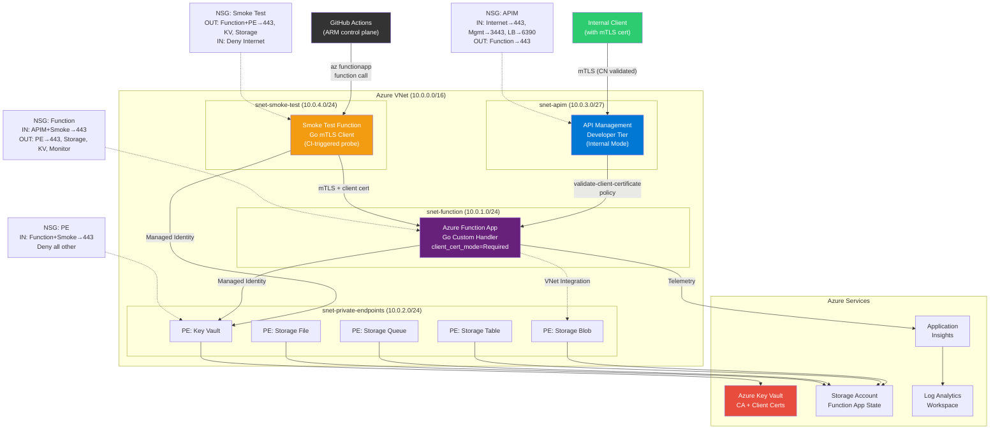
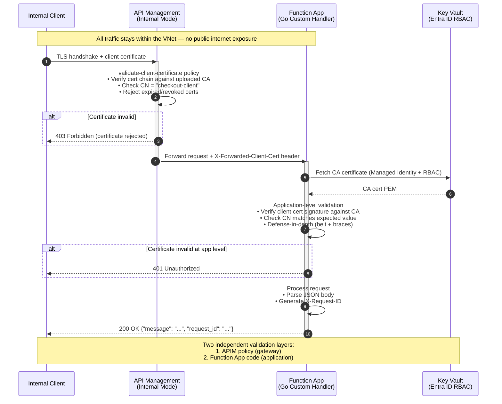

[](https://github.com/ko5tas/checkout.com_interview/actions/workflows/ai-advisor.yml)

# Checkout.com Cloud Platform Engineering — Technical Assessment

Internal API deployment on Azure with Terraform, mTLS, observability, and CI/CD.

## Architecture Diagram



## mTLS Handshake & Trust Chain



## Compliance Mapping

This implementation was designed with payment industry compliance frameworks in mind. The table below maps architectural decisions to specific controls, demonstrating that each technical choice serves a compliance purpose — not just a functional one.

| Control Area | PCI DSS 4.0.1 | NIST CSF 2.0 | What We Implement |
|---|---|---|---|
| **Network Segmentation** | Req 1.3 — Restrict CDE traffic | PR.DS — Data Security | NSG microsegmentation with explicit subnet CIDRs and ports; deny-all default rules; no `VirtualNetwork` catch-all |
| **Encryption in Transit** | Req 4.2 — Strong cryptography | PR.DS-2 — Data-in-transit | mTLS end-to-end: client → APIM (cert validation policy) → Function App (application-level verification). TLS 1.2 minimum |
| **Defense in Depth** | Req 1.2 + 6.2 — Layered controls | PR.PT — Protective Technology | Two independent certificate validation layers (APIM gateway + Function App code). Neither trusts the other |
| **Least Privilege Access** | Req 7.2 — Need-to-know | PR.AC — Access Control | Managed Identity with scoped RBAC roles (Key Vault Secrets User, not Contributor). No access policies, no stored credentials |
| **Identity & Authentication** | Req 8.3 — Strong authentication | PR.AC-7 — Authentication | OIDC federation from GitHub Actions to Azure (no client secrets). Entra ID RBAC for all service-to-service auth |
| **Logging & Monitoring** | Req 10.2 — Audit trail | DE.CM — Continuous Monitoring | Diagnostic settings on all resources → Log Analytics. Application Insights for function telemetry. X-Request-ID for tracing |
| **Secure Development** | Req 6.3 — Security in SDLC | PR.IP — Protective Processes | `go vet`, `golangci-lint`, `govulncheck`, `go test -race` in CI. Trivy for Terraform scanning. PR-based changes with branch protection |
| **IaC Governance** | Req 6.5 — Change management | GV.OC — Organisational Context | All infrastructure defined in Terraform. Plan → AI analysis → manual approval → apply. No ad-hoc changes |
| **Asset Inventory** | Req 12.5 — Asset management | ID.AM — Asset Management | Terraform state as machine-readable asset inventory. Subnet/service mapping in architecture diagram |
| **Recoverability** | Req 12.10 — Incident response | RC.RP — Recovery Planning | Terraform state enables full environment rebuild. Nightly destroy/recreate cycle proves recoverability daily |

**Production hardening (documented as future improvements):**
- NSG flow logs for Req 10.4 (network traffic audit trail)
- Azure Policy for continuous compliance auditing (Req 6.3.2)
- Customer-managed keys for state file encryption at rest (Req 3.5)
- WAF integration at APIM tier for OWASP protection (Req 6.4)
- Penetration testing schedule (Req 11.3)

> This architecture aligns with [NIST SP 800-207 Zero Trust](https://www.nist.gov/publications/zero-trust-architecture) principles: never trust, always verify (mTLS at two layers), microsegmentation (explicit NSG rules), least privilege (scoped RBAC), and assume breach (defense-in-depth). It also reflects [Checkout.com's published engineering philosophy](https://spacelift.io/blog/platform-engineering-infrastructure-automation) of "IaC for everything" within regulated environment constraints.

## VNet-Internal Smoke Testing with mTLS

The API runs on a private network and requires mTLS, making it unreachable from GitHub Actions runners on the public internet. We solve this with a **split-plane testing** pattern:

```
GitHub Runner (public internet)
  → az functionapp keys list (ARM control plane — always reachable)
  → curl https://smoke-func.azurewebsites.net/api/smoketest?code=<key>
    → Smoke Test Function (snet-smoke-test, inside VNet)
      1. Fetches client cert + key from Key Vault (Managed Identity + RBAC)
      2. Makes HTTPS POST with mTLS to main function's private endpoint
      3. Validates: HTTP 200, response body schema, X-Request-ID header
      → Returns structured JSON with pass/fail per test case
  → GitHub Runner reads result, fails the pipeline if any test fails
```

**What this proves:**
- VNet connectivity (smoke-test subnet → function subnet via private endpoint)
- Private DNS resolution (privatelink.azurewebsites.net)
- Key Vault RBAC + Managed Identity (cert retrieval)
- mTLS handshake (client cert CN validation)
- Go handler logic (payload processing, response format)
- End-to-end latency under real network conditions

**Cost:** ~$13/month (Basic B1 plan, required for VNet integration; ~$6/month with nightly destroy schedule). Consumption Y1 does NOT support VNet integration — Azure silently rejects the `virtual_network_subnet_id` setting on Dynamic SKU.

**Alternatives considered:**
- Azure Container Instance (ACI): ephemeral but awkward VNet/DNS integration
- Self-hosted runner in VNet: ~$15/month, overkill for this assessment
- Azure Bastion: ~$140/month, far too expensive

## Design Decisions

### Module Repository Strategy

**Production approach (recommended):** Each Terraform module lives in its own Git repository under a dedicated GitHub organisation (e.g., `checkout-terraform-modules/`):

- `terraform-azurerm-networking`
- `terraform-azurerm-function-app`
- `terraform-azurerm-api-management`
- `terraform-azurerm-observability`
- `terraform-azurerm-key-vault`
- `terraform-azurerm-certificates`

**Benefits:**
- Module development is decoupled from provisioning (implementation) code
- Git history is clean and readable — no dev code mixed with infra code
- Modules are versioned via Git tags and consumed as `source = "git::https://github.com/org/terraform-azurerm-networking.git?ref=v1.2.0"`
- Separate CI pipelines for module testing vs infrastructure provisioning
- Reusable across multiple projects and teams

**This assessment:** Uses a monorepo with local `./modules/` for pragmatic submission, but the structure is designed for easy extraction into separate repos.

### Remote State Architecture

**The chicken-and-egg problem:** Terraform needs a backend to store state, but that backend (Azure Storage Account) must itself be provisioned before Terraform can run.

**Solution:** A bootstrap script (`scripts/bootstrap-state.sh`) using Azure CLI:

1. Creates a Resource Group for state storage
2. Creates a Storage Account with blob versioning + 30-day soft-delete
3. Creates a blob container for tfstate files
4. Outputs the backend configuration for `providers.tf`

**Authentication options:**

| Option | Use Case | How |
|--------|----------|-----|
| **GitHub OIDC** | CI/CD-driven workflows | Azure AD app registration with federated credential for the GitHub repo. Secrets: `AZURE_CLIENT_ID`, `AZURE_SUBSCRIPTION_ID`, `AZURE_TENANT_ID` |
| **Local bootstrap** | Initial setup, strict secret management | `az login` on a trusted engineer's machine. No secrets stored in GitHub. |

### mTLS & Defense-in-Depth

Two layers of certificate validation protect against compromised internal services:

**Layer 1 — APIM Gateway:**
- `validate-client-certificate` XML policy checks issuer, subject CN, and expiry
- Even if a compromised service has VNet access, it needs a cert with CN `api-client.internal.checkout.com` signed by our CA

**Layer 2 — Function App (application level):**
- `client_certificate_mode = "Required"` enforced at platform level
- Go code validates the `X-ARR-ClientCert` header: decodes cert, verifies CA chain, checks CN
- Strict payload validation: `DisallowUnknownFields()`, max size, type checking

### Function App Deployment Strategy

**Approach:** Terraform manages infrastructure (Function App resource, App Service Plan, storage, networking). Application code is deployed separately via `az functionapp deployment source config-zip` in the CI/CD pipeline.

**Why not deploy app code via Terraform?**

| Consideration | Terraform-only | Hybrid (current) |
|--------------|----------------|-------------------|
| Change cadence | Infra + app coupled — app change triggers full plan/apply | App deploys independently in seconds |
| Blast radius | Bad app code triggers Terraform state changes | App deploy failure doesn't touch infra state |
| Speed | Full plan+apply cycle (~minutes) | Zip deploy (~seconds) |
| Declarative purity | ✅ Everything in state | ❌ App deploy is imperative |
| Complexity | Lower — single tool | Higher — two deployment mechanisms |

**Decision:** The hybrid approach is intentional. In production with frequent app releases, decoupling app deployment from infrastructure changes reduces blast radius and speeds up the inner dev loop. The trade-off (imperative `az` CLI step) is acceptable because the deploy step is idempotent and stateless.

**Custom handler note:** Azure Functions with Go custom handlers require `linuxFxVersion=CUSTOM|` to be set explicitly before `config-zip` deployment on Consumption plans, as Azure cannot auto-detect the runtime.

### Technology Choices

| Choice | Rationale |
|--------|-----------|
| Go custom handler | Systems engineering signal; performant; type-safe |
| APIM Developer tier | Full VNet injection (`Internal` mode); native mTLS policy; enterprise pattern |
| West Europe region | Originally UK South (Checkout.com is UK-based); migrated due to free-trial quota limitations — see Decision Log #4 |
| tfvars (not workspaces) | Explicit, readable environment separation |
| Consumption plan (Y1) | Cost-effective for assessment; production would use Premium for always-on VNet |

## Setup & Deployment

### Prerequisites

- [Terraform](https://terraform.io) >= 1.6.0
- [Go](https://golang.org) >= 1.22
- [Azure CLI](https://docs.microsoft.com/en-us/cli/azure/) >= 2.50
- An Azure subscription

### 1. Bootstrap State Backend

```bash
az login
./scripts/bootstrap-state.sh
# Follow the output to update providers.tf with the backend block
```

### 2. Build the Go Function

```bash
cd function-app
GOOS=linux GOARCH=amd64 go build -o handler .
```

### 3. Deploy Infrastructure

```bash
# Set your subscription ID
export TF_VAR_subscription_id="your-subscription-id"

terraform init
terraform plan -var-file=environments/dev.tfvars
terraform apply -var-file=environments/dev.tfvars
```

### 4. Verify Deployment

```bash
# From within the VNet (bastion/jumpbox):
./scripts/test-api.sh \
  https://apim-checkout-dev.azure-api.net \
  ./certs/client.pem \
  ./certs/client-key.pem \
  ./certs/ca.pem
```

Or use the APIM Developer tier test console in Azure Portal.

## Testing

### Go Unit Tests

```bash
cd function-app
go test -v -race ./...
```

### Terraform Native Tests

```bash
terraform test
```

### Terratest Integration Tests

```bash
cd tests
go test -v -timeout 60m ./...
```

### Quality Checks

```bash
# Terraform
terraform fmt -check -recursive
terraform validate
tflint --recursive
trivy config .
checkov -d .

# Go
cd function-app
golangci-lint run
go vet ./...
```

### CI/CD Pipelines

| Workflow | Trigger | Purpose |
|----------|---------|---------|
| `terraform.yml` | PR & push to main | `fmt -check`, `validate`, TFLint, Trivy, Checkov, `terraform plan` |
| `go.yml` | PR & push to main | `go vet`, `golangci-lint`, `go test -race`, builds both function apps |
| `deploy.yml` | Manual (`workflow_dispatch`) | Full deploy: plan → AI analysis → approval → apply → zip deploy → smoke tests |
| `release.yml` | Semver tags (`[0-9]+.*`) | Go build, create GitHub Release with artifacts |
| `budget-guard.yml` | Daily 06:00 UTC | Checks remaining Azure credits, creates issue if below threshold |
| `schedule.yml` | Nightly 02:00 UTC | `terraform destroy` to save costs during off-hours |

**Function App deployment** uses `Azure/functions-action@v1` (not `az functionapp deployment source config-zip`) because OIDC federated tokens authenticate to the ARM management plane only — they cannot access the Kudu/SCM data plane endpoint that `config-zip` requires. The official GitHub Action handles this by fetching publish credentials internally via ARM.

**Smoke test** runs as the final pipeline stage: the CI runner invokes the smoke test Azure Function (via master key), which in turn calls the main Function App over HTTPS with an mTLS client certificate fetched from Key Vault using Managed Identity. This proves the internal API works end-to-end from inside Azure.

### Environment Deployment

```bash
# Dev (default)
gh workflow run deploy.yml -f environment=dev -f action=apply

# Prod
gh workflow run deploy.yml -f environment=prod -f action=apply

# Destroy
gh workflow run deploy.yml -f environment=dev -f action=destroy
```

## Teardown

```bash
terraform destroy -var-file=environments/dev.tfvars
```

**Manual steps:**
- Key Vault with purge protection requires manual purge after the soft-delete retention period (7 days)
- If bootstrap state backend is no longer needed: `az group delete --name rg-tfstate-westeurope`

## OIDC Configuration for GitHub Actions

GitHub Actions authenticates to Azure using OpenID Connect (OIDC) — no long-lived secrets are stored. Instead, GitHub requests a short-lived token from Azure AD using a federated identity credential that trusts the GitHub OIDC provider.

### Step 1: Create an Azure AD App Registration

This is the identity that GitHub Actions will authenticate as.

```bash
az ad app create --display-name "github-actions-checkout-platform" \
  --query "{appId:appId, objectId:id}" -o json
```

Save the `appId` (client ID) and `objectId` (needed for federated credential commands).

### Step 2: Create Federated Credentials

Federated credentials tell Azure AD which GitHub workflows are allowed to authenticate as this app. Each credential is scoped to a specific trigger type — this prevents unauthorized repos or workflows from impersonating the identity.

**For pushes to `main` and tagged releases:**

```bash
az ad app federated-credential create \
  --id <APP_OBJECT_ID> \
  --parameters '{
    "name": "github-main",
    "issuer": "https://token.actions.githubusercontent.com",
    "subject": "repo:ko5tas/checkout.com_interview:ref:refs/heads/main",
    "audiences": ["api://AzureADTokenExchange"]
  }'
```

Why: The Terraform CI workflow runs on pushes to `main`, and the release workflow triggers on `v*` tags (which resolve to the main branch). Both need this credential.

**For pull requests** (Terraform Plan):

```bash
az ad app federated-credential create \
  --id <APP_OBJECT_ID> \
  --parameters '{
    "name": "github-pr",
    "issuer": "https://token.actions.githubusercontent.com",
    "subject": "repo:ko5tas/checkout.com_interview:pull_request",
    "audiences": ["api://AzureADTokenExchange"]
  }'
```

Why: The `terraform plan` job runs on PRs to show infrastructure changes before merging. Without this credential, PR workflows can't authenticate to Azure.

### Step 3: Create a Service Principal and Assign Roles

The app registration is an identity — the service principal makes it usable in Azure RBAC, and the role assignment grants it permissions.

```bash
# Create the service principal (makes the app usable in Azure RBAC)
az ad sp create --id <APP_ID>

# Grant Contributor on the target subscription
az role assignment create \
  --assignee <APP_ID> \
  --role Contributor \
  --scope /subscriptions/<SUBSCRIPTION_ID>
```

Why Contributor: Terraform needs to create, modify, and delete resources. Contributor grants this without allowing role assignment changes (which would require Owner). For production, consider a custom role with only the specific permissions needed.

### Step 4: Set GitHub Repository Secrets

These secrets are referenced in the workflow files via `${{ secrets.AZURE_CLIENT_ID }}` etc. They are never exposed in logs.

```bash
gh secret set AZURE_CLIENT_ID --body "<APP_ID>"
gh secret set AZURE_SUBSCRIPTION_ID --body "<SUBSCRIPTION_ID>"
gh secret set AZURE_TENANT_ID --body "<TENANT_ID>"
```

| Secret | What It Is | Where It Comes From |
|--------|-----------|-------------------|
| `AZURE_CLIENT_ID` | App registration's Application (client) ID | `az ad app create` output |
| `AZURE_SUBSCRIPTION_ID` | Target Azure subscription | `az account show --query id` |
| `AZURE_TENANT_ID` | Azure AD tenant | `az account show --query tenantId` |

### Step 5: (Optional) Set Gemini API Key for AI Features

The deploy pipeline and weekly AI advisor use Google Gemini (free tier) for plan risk analysis and codebase improvement suggestions. Without this key, those steps gracefully degrade to deterministic-only analysis.

1. Go to [aistudio.google.com](https://aistudio.google.com) → "Get API key" → "Create API key"
2. Free tier: 15 requests/minute, 1M tokens/day — more than sufficient for CI/CD use
3. Set it as a GitHub secret:

```bash
gh secret set GEMINI_API_KEY --body "<YOUR_GEMINI_API_KEY>"
```

| Secret | What It Is | Where It Comes From |
|--------|-----------|-------------------|
| `GEMINI_API_KEY` | Google Gemini API key | [aistudio.google.com](https://aistudio.google.com) |

**What it powers:**
- `deploy.yml` → AI Plan Analysis job: natural-language risk summary of terraform plan changes
- `ai-advisor.yml` → Weekly codebase review: dependency updates, security advisories, architecture improvements

### How OIDC Works in the Workflow

```yaml
# The workflow requests a token from Azure AD
- uses: azure/login@v2
  with:
    client-id: ${{ secrets.AZURE_CLIENT_ID }}
    tenant-id: ${{ secrets.AZURE_TENANT_ID }}
    subscription-id: ${{ secrets.AZURE_SUBSCRIPTION_ID }}
```

GitHub sends its OIDC token to Azure AD → Azure AD validates the token against the federated credential (checking issuer, subject, audience) → Azure AD issues a short-lived access token → Terraform uses that token via `ARM_USE_OIDC=true`.

### Teardown

To remove the OIDC configuration:

```bash
# Delete the app registration (also removes SP and federated credentials)
az ad app delete --id <APP_ID>

# Remove GitHub secrets
gh secret delete AZURE_CLIENT_ID
gh secret delete AZURE_SUBSCRIPTION_ID
gh secret delete AZURE_TENANT_ID
```

## Assumptions

- **Azure Entra ID (identity) setup is simplified** — a single app registration with Contributor on the default subscription. Production would implement a proper Entra ID design: dedicated subscriptions per environment, custom RBAC roles scoped to specific resource groups, separate app registrations per workflow, and Entra ID groups for access governance. This was a conscious time/complexity trade-off for the assessment.
- Self-signed certificates only; no custom domain or commercial certificates purchased
- APIM Developer tier for full mTLS and VNet injection (production would evaluate Premium tier)
- Function App Consumption plan (Y1) for cost; Premium plan needed for always-on VNet integration in production
- Single region (West Europe); multi-region not in scope
- Remote state documented but not pre-provisioned (run `bootstrap-state.sh` first). **Alternative approach:** the pipeline could create the state backend storage account using Terraform with local state on the ephemeral GitHub runner, then use `terraform state push` to migrate the local state into the newly created remote backend. This eliminates the `az` CLI bootstrap script entirely and keeps everything in Terraform, though it requires careful handling of the state migration step (init with local backend → apply → re-init with remote backend → push state).
- Python/Node/Java alternatives considered; Go chosen for type safety and performance
- `authLevel: "anonymous"` on Function App HTTP trigger because authentication is handled by mTLS at both APIM and Function App layers
- **Centralised Entra ID RBAC for Key Vault** — Key Vault uses `enable_rbac_authorization = true` with Azure RBAC role assignments instead of vault-local access policies. This centralises all authN/authZ through Entra ID, enabling Conditional Access, PIM, unified audit logs, and Management Group policy enforcement.
- **Storage account still uses shared keys** — Azure Functions Consumption (Y1) plan on Linux **requires** `storage_account_access_key` for `AzureWebJobsStorage`; Managed Identity-based storage access is only supported on Elastic Premium (EP1+) and Dedicated plans. This is a known Microsoft limitation. Production would upgrade to EP1+ and use Managed Identity with `Storage Blob Data Owner` role for full Entra ID centralisation.
- **Future improvements for full Entra ID centralisation:**
  - Migrate to Elastic Premium plan to enable Managed Identity for Function App storage
  - Implement Entra ID groups for RBAC role assignments (e.g., `Platform-Engineers` group → `Key Vault Administrator`)
  - Add Management Groups to enforce policies across subscriptions (e.g., deny legacy access policy model)
  - Enable Privileged Identity Management (PIM) for JIT elevation to sensitive roles
  - Configure Conditional Access policies requiring MFA for Key Vault data plane access
- **Terraform state splitting (blast radius reduction)** — currently all resources share a single state file (`checkout-dev.tfstate`). Production should split into domain-specific state files to reduce blast radius:

  | State File | Resources | Change Frequency |
  |-----------|-----------|-----------------|
  | `network.tfstate` | VNet, subnets, NSGs, private DNS zones | Rarely |
  | `apim.tfstate` | APIM, certs, policies, private endpoint | Rarely (expensive, 28 min to provision) |
  | `app.tfstate` | Function App, storage, Key Vault, secrets | Frequently |
  | `observability.tfstate` | Log Analytics, App Insights, diagnostics | Rarely |

  Benefits: a failed APIM apply doesn't corrupt networking state; app redeployment doesn't touch APIM; `terraform destroy` blast radius limited to one domain. Cross-state references use `terraform_remote_state` data sources.
- **APIM race condition mitigation** — Azure APIM Developer tier takes ~28 minutes to provision. When it completes, Azure's internal async processes (diagnostics, DNS, internal certs) continue running. We use `time_sleep` (60s) after APIM creation with explicit `depends_on` on all child resources. This is a known azurerm provider issue ([#24135](https://github.com/hashicorp/terraform-provider-azurerm/issues/24135)).
- **Zero Trust NSG microsegmentation** — Every NSG rule uses explicit subnet CIDRs and specific ports instead of the `VirtualNetwork` service tag catch-all. No implicit lateral movement is allowed between subnets. Traffic flow matrix:

  | Source | Destination | Port | Purpose |
  |--------|------------|------|---------|
  | APIM subnet | Function subnet | 443 | API gateway → backend |
  | Smoke test subnet | Function subnet | 443 | mTLS integration test |
  | Smoke test subnet | PE subnet | 443 | Key Vault cert fetch |
  | Function subnet | PE subnet | 443 | KV + Storage private endpoints |
  | Function subnet | Storage (svc endpoint) | 443 | AzureWebJobsStorage |
  | Function subnet | KeyVault (svc endpoint) | 443 | Key Vault secrets |
  | Function subnet | AzureMonitor (svc tag) | 443 | Telemetry |
  | Internet | APIM subnet | 443 | Client → gateway |
  | ApiManagement | APIM subnet | 3443 | Azure control plane |
  | AzureLoadBalancer | APIM subnet | 6390 | Health probes |

  All subnets have explicit deny-all inbound rules at priority 4096.

- **Future: Azure Virtual Network Manager (AVNM)** — For multi-team or multi-subscription deployments, AVNM provides hub-and-spoke network topology management with centralised security admin rules. Benefits over per-VNet NSGs: (1) admin rules that cannot be overridden by subnet NSGs, (2) automatic mesh connectivity between spokes, (3) centrally managed security policies. This is documented but not implemented as the assessment uses a single VNet.
- **Future: Comprehensive Azure resource tagging strategy** — Production deployments should enforce a tagging policy via Azure Policy (deny resources missing required tags). Recommended tags: `environment` (dev/staging/prod), `cost-centre`, `owner`, `managed-by` (terraform), `project`, `created-date`, `data-classification` (public/internal/confidential). Tags enable cost allocation, automated cleanup (e.g., destroy resources tagged `environment=dev` after hours), compliance reporting, and blast radius identification during incidents.
- **Future: Self-hosted GitHub Actions runners on Azure VMs** — Replace GitHub-hosted runners with self-hosted runners deployed as Azure VMs (or VMSS for auto-scaling) inside the VNet. Benefits: (1) runners use Azure Managed Identity for OIDC-free authentication — no stored credentials or federated identity setup needed, (2) runners have direct VNet access to private endpoints, eliminating the need for the smoke test split-plane workaround, (3) egress traffic stays on the Azure backbone, (4) runners can be placed in a dedicated `snet-runners` subnet with microsegmented NSG rules, (5) full control over runner OS, toolchain, and security patching. The Managed Identity assigned to the runner VM would have scoped RBAC roles (Contributor on the target resource group, Storage Blob Data Contributor on the state backend). This eliminates the entire OIDC federation complexity documented in the Setup section.

## Estimated Azure Costs

| Resource | Monthly Cost |
|----------|-------------|
| Function App — main (Consumption Y1) | ~$0 (1M free executions) |
| Function App — smoke test (Basic B1) | ~$13 (~$6 with nightly destroy) |
| APIM Developer tier | ~$50 |
| Storage Account — main (LRS) | ~$1 |
| Storage Account — smoke test (LRS) | ~$1 |
| Key Vault | ~$0.03/10K operations |
| Log Analytics (5GB free) | ~$0 |
| Application Insights (5GB free) | ~$0 |
| Private Endpoints (x5) | ~$37.50 ($7.50 each) |
| **Total** | **~$90-100/month** |

> Destroy resources promptly after assessment review to minimise costs.

### Cost Control: Decision Log

1. **Free Trial spending limit blocked provisioning.** Azure Free Trial subscriptions have a spending limit that prevents creating Consumption plan (Dynamic VM) resources — Azure returns a misleading `401 Unauthorized` / `Dynamic VMs quota: 0` error. The fix was upgrading the subscription from Free Trial to Pay-As-You-Go, which removed the spending limit while preserving the remaining £147.77 credit.

2. **Budget set to exact remaining credits.** We created an Azure budget (`free-trial-guard`) set to £147.77 with email notifications at 80% and 100% thresholds via the Cost Management REST API. This prevents silent overspend.

3. **Daily Budget Guard workflow** (`budget-guard.yml`). Runs daily at 07:23 UTC and checks two conditions:
   - **Credit expiry date** — configured via `CREDIT_EXPIRY_DATE` repo variable (set to 2026-04-16, matching Azure portal credit expiry)
   - **Cumulative spend** — queries the Cost Management API and compares against the budget amount

   If either condition is true, the workflow automatically:
   - Destroys all dev infrastructure (`terraform destroy`)
   - Sets the budget to £0.01 (Azure minimum)
   - Cleans up the state backend storage account if no other environments remain
   - Opens a GitHub Issue documenting the teardown with full audit trail

   This ensures **zero accidental charges** after credits expire or run out, even if someone forgets to manually destroy resources.

4. **Region migration from UK South to West Europe.** After upgrading to Pay-As-You-Go, the subscription's internal offer type change had not fully propagated (both `offerType` and `spendingLimit` returned `null` from `az account show`). This meant the Dynamic VM (Consumption plan) quota remained at 0 in UK South, and quota increase requests were blocked with _"Your free trial subscription isn't eligible for a quota increase"_. Rather than wait 24-48 hours for Azure's backend replication, we pivoted the dev environment to `westeurope` — a region with broader default quota allocation for free-tier subscriptions. The migration required:
   - Updating `environments/dev.tfvars` to `location = "westeurope"`
   - Running `terraform destroy` on the existing UK South infrastructure
   - Fixing the azurerm provider to set `prevent_deletion_if_contains_resources = false` in the `resource_group` feature block — Azure auto-creates Smart Detection alert rules and action groups inside resource groups containing Application Insights, and these orphaned resources block Terraform's resource group deletion
   - **Manual step:** Deleting the `NetworkWatcher_uksouth` resource from the `NetworkWatcherRG` resource group via the Azure Portal. This is an Azure-auto-created free diagnostic resource that is not managed by Terraform and was no longer needed after the region move. The `NetworkWatcherRG` resource group itself was also deleted.
   - The Terraform state backend (`rg-tfstate-westeurope` / `sttfstate202603`) was intentionally kept in UK South — it stores state files for all environments and incurs negligible cost (~£0.01/month for blob storage).

5. **Nightly schedule destroys state backend too.** The `schedule.yml` nightly destroy not only runs `terraform destroy` on application resources but also cleans up the dev state blob and, if no other environments exist, deletes the state storage account itself — eliminating all residual cost.

6. **Stale Terraform state from failed partial applies.** When a `terraform apply` partially succeeds (e.g., creates a resource group and storage account, then fails on APIM), and you subsequently run `terraform destroy` which deletes the resource group, the state file retains references to resources that no longer exist. The next `apply` fails with `404 Not Found` errors. **Lesson learned:** before re-applying after a destroy that followed a partial apply, verify state is clean — either run `terraform state list` to check, or delete the state blob for a fresh start. In our case, we deleted `checkout-dev.tfstate` from the state backend storage account, then also had to manually delete the orphaned `rg-checkout-dev` resource group that Azure had recreated during the partial apply.

### Cost Optimisation: Improvements & Recommendations

The following recommendations are informed by the [Azure Well-Architected Framework — Cost Optimisation pillar](https://learn.microsoft.com/en-us/azure/well-architected/pillars), real-world lessons from this assessment, and industry FinOps best practices.

#### 1. Shift-Left Cost Estimation with Infracost

**Problem:** Engineers don't see cost impact until after deployment — by then, expensive resources like APIM Developer ($50/month), Azure Firewall Basic ($288/month), or ExpressRoute ($900+/month) are already provisioned and burning budget.

**Solution:** Integrate [Infracost](https://www.infracost.io/) into the CI pipeline. Infracost analyses `terraform plan` output and posts a PR comment showing estimated monthly cost *before* any resources are created. It supports 1,100+ Terraform resources across Azure, AWS, and GCP.

```yaml
# Example: .github/workflows/infracost.yml
- uses: infracost/actions/setup@v3
  with:
    api-key: ${{ secrets.INFRACOST_API_KEY }}
- run: infracost diff --path=. --format=json --out-file=/tmp/infracost.json
- uses: infracost/actions/comment@v3
  with:
    path: /tmp/infracost.json
    behavior: update
```

**Impact:** Every PR gets a cost annotation. A developer adding `azurerm_firewall` would immediately see "+$912/month" in the PR — before it reaches `main`.

#### 2. Azure Budget Blowers: A Reference Guide

Certain Azure resources carry disproportionately high costs that can silently exhaust a dev/test budget. Engineers should be aware of these before including them in Terraform configs:

| Resource | Hourly Cost | Monthly Cost | Dev/Test Alternative |
|----------|------------|-------------|---------------------|
| **Azure Firewall Premium** | $1.84 | ~$1,300 | NSG rules + Azure Firewall Basic ($288/mo) or NSGs only |
| **Azure Firewall Standard** | $1.25 | ~$912 | Azure Firewall Basic or NSGs |
| **Azure Firewall Basic** | $0.395 | ~$288 | NSGs (free) for dev/test |
| **ExpressRoute (Standard)** | — | ~$900+ | VPN Gateway Basic ($27/mo) or site-to-site VPN |
| **Application Gateway v2** | $0.246 | ~$180 | Stop/deallocate during off-hours ($0 when stopped) |
| **NAT Gateway** | $0.045 | ~$32 + data | Remove in dev; use default SNAT |
| **APIM Developer** | $0.067 | ~$50 | APIM Consumption (free for first 1M calls) |
| **APIM Premium** | $2.78 | ~$2,000 | APIM Developer for non-prod |
| **Azure SQL (General Purpose)** | — | ~$370+ | Basic tier ($5/mo) or SQL Server on container |
| **Private Endpoints** | $0.01 | ~$7.50 each | Acceptable, but multiply quickly (5×$7.50 = $37.50) |

> ⚠️ **Key lesson from this project:** APIM Developer tier takes 30-45 minutes to provision. A failed Terraform apply that creates APIM then fails on a subsequent resource means you've burned 45 minutes of APIM cost *and* need to destroy/recreate. Always validate your full config with `terraform plan` and fix ALL errors before running `apply`.

#### 3. Preventing Wasteful Deploy Cycles

Our experience during this assessment exposed a pattern that wastes both time and money:

```
apply (partial success) → fix error → destroy (fails on orphans) →
fix provider → destroy (succeeds) → apply (stale state) →
clean state → apply (orphaned RG) → delete RG → apply (finally works)
```

**Mitigation strategies:**

- **Pre-flight validation:** Run `terraform validate` and `terraform plan` in CI before any `apply`. Gate `apply` behind a successful plan.
- **Targeted applies for expensive resources:** Use `terraform apply -target=module.networking` first, then `-target=module.function_app`, then `-target=module.api_management`. This isolates failures and avoids re-provisioning expensive resources.
- **Idempotent destroy:** Configure the azurerm provider with `prevent_deletion_if_contains_resources = false` from the start — Azure auto-creates resources (Smart Detection alerts, NetworkWatcher) that block idempotent destroys.
- **State hygiene:** After a failed partial apply followed by a manual cleanup, always verify state with `terraform state list` before re-applying. Orphaned state entries cause `404` errors; orphaned Azure resources cause `already exists` errors.
- **Cost-aware retry limits:** Set a maximum retry count for deploy workflows. After N failures, stop retrying and alert — don't keep creating and destroying expensive resources in a loop.

#### 4. Architectural Patterns for Cost Control

- **Module isolation:** Structure Terraform modules so expensive resources (APIM, Firewall) are in their own state files or have clear dependency boundaries. This allows targeted operations without touching the full stack.
- **Feature flags via variables:** Use `enable_apim = false` type variables to skip expensive resources in dev/test, allowing engineers to test networking and function app logic without provisioning APIM.
- **Consumption over Dedicated:** Prefer Azure Functions Consumption plan, APIM Consumption tier, and serverless options wherever feature parity allows. The cost difference can be 10-100x.
- **Auto-shutdown schedules:** This project implements nightly destroy (02:00-09:00). For resources that can be stopped without destruction (VMs, Application Gateways), prefer stop/deallocate over full destroy to save re-provisioning time.
- **Budget alerts at multiple thresholds:** We set alerts at 80% and 100%. Production should add 50% and 25% thresholds with automated scaling-down actions at each tier.

#### 5. FinOps Culture: Making Cost a First-Class Citizen

- **Tag everything:** Every resource should have `cost_center`, `environment`, and `owner` tags for attribution and automated cleanup.
- **Daily cost review:** The Budget Guard workflow runs daily, but engineers should also have visibility via Azure Cost Management dashboards scoped to their resource groups.
- **Post-mortem on cost incidents:** When a deploy cycle wastes money (as happened during our region migration), document it as a decision log entry (see entries #4 and #6 above) so the team learns from it.
- **Right-size continuously:** Azure Advisor provides right-sizing recommendations. Review them weekly in non-prod, monthly in prod.

> 📚 **Further reading:**
> - [Azure Well-Architected Framework — Cost Optimisation](https://learn.microsoft.com/en-us/azure/well-architected/pillars)
> - [APIM Cost Optimisation Guide](https://learn.microsoft.com/en-us/azure/well-architected/service-guides/api-management/cost-optimization)
> - [Infracost — Shift FinOps Left](https://www.infracost.io/)
> - [Azure Firewall Pricing](https://azure.microsoft.com/en-us/pricing/details/azure-firewall/)
> - [HCP Terraform Cost Estimation](https://developer.hashicorp.com/terraform/cloud-docs/workspaces/cost-estimation)

## AI Usage & Critique

This implementation was built with Claude (Anthropic) as an AI coding assistant across multiple intensive sessions. The collaboration followed a deliberate pattern: I set architectural direction and constraints, the AI generated implementation, and I challenged assumptions at every layer. Prompts are grouped by theme to show the breadth of the collaboration.

### Prompts Used

**Architecture & Design**
- *"Given the technical assessment PDF, let's start addressing each issue and build a SKILL.md library"* — Kickoff prompt that set the pattern of documenting decisions as reusable skills alongside implementation. Every significant discovery (state hygiene anti-patterns, azurerm provider bugs, cost optimisation patterns) was captured in `.claude/skills/` as a living knowledge base.
- *"I see a tendency you finding 'known azurerm provider' issues. Let's bake a mechanism into your memory and a SKILL"* — Created `.claude/skills/azurerm-provider-known-issues.md` as a living registry of provider bugs and workarounds, so lessons aren't lost between sessions.
- *"I want us to use centralised Entra ID authN/AuthZ"* — Drove the shift from Key Vault access policies to `rbac_authorization_enabled = true` with `azurerm_role_assignment` for all service identities.
- *"Can you explain why you were deploying the function app via az CLI and not Terraform?"* — Challenged the hybrid deployment approach. Led to an explicit design decision documenting the trade-off (speed + blast radius vs declarative purity).
- *"On step 2 do we split our state files into smaller chunks?"* — Evaluated state-per-domain splitting; chose to document as a future improvement rather than over-engineer for a single-environment assessment.

**Security & Zero Trust**
- *"We need to be explicit on any egress/ingress communication, even between subnets within the same VNet"* — Prompted Zero Trust NSG microsegmentation with explicit subnet CIDRs and ports, replacing broad `VirtualNetwork` catch-all rules.
- *"Why did you choose subscription_id as a sensitive value?"* — Pushed back on the AI marking `subscription_id` as sensitive. Subscription IDs are not secrets — marking them sensitive hides useful plan output. Reverted.
- *"Try and avoid terraform imports! That is a bad pattern. Instead get your priority solution selection from what you are hinted"* — Rejected `terraform import` in CI as a hack for the APIM race condition. Led to the `time_sleep` + `depends_on` pattern instead.

**CI/CD & Quality**
- *"I only see terraform-related workflows. Why did we not follow through with the Go side?"* — Challenged the AI to treat app code with equal CI/CD rigour, resulting in `go.yml` with `go vet`, `golangci-lint`, `go test -race`, and build verification.
- *"What happens if the release fails? Do we have graceful rollback?"* — Added rollback considerations and SAST/DAST analysis for Go.
- *"Will you be able to monitor for that long? In the past you've gone quiet"* — Exposed `gh run watch` unreliability for long deploys (~30 min APIM provisioning). Switched to polling with `gh run view`. Stored as a permanent memory item.

**Cost & Operations**
- *"I'm afraid you might blow up my $200 budget"* — Triggered budget-guard workflow, nightly destroy schedule, Infracost documentation, and a detailed cost control decision log.
- *"Add notes about improvements. I would pay close attention to avoiding these money wasteful cycles"* — Drove FinOps documentation including region migration costs, failed deploy retry costs, and APIM Developer tier impact.
- *"Those gh delete commands you ran from my machine, would it make sense to have them on a cleanup/destroy pipeline?"* — Led to automated teardown workflows instead of manual `az` commands.

**Debugging & Troubleshooting**
- *"Investigate deeply, thoroughly and ultrathink!"* — Deep dive into APIM "already exists" race condition on clean deploys. Root cause: Azure's internal async processes racing with Terraform after 28-min provisioning.
- *"It failed again and you were not even monitoring it"* — Drove persistent deploy monitoring discipline and the switch from `gh run watch` to polling loops.

### Critique of AI Output

**What worked well:**
- Comprehensive module structure following HashiCorp naming conventions
- Defense-in-depth mTLS approach (APIM + Function App level validation)
- Quality toolchain selection (identified tfsec deprecation in favour of Trivy)
- Circular dependency detection between observability and function-app modules

**Issues identified and corrected:**
- Initial suggestion used APIM Consumption tier which doesn't support `virtual_network_type = "Internal"` — corrected to Developer tier after discussion
- Initial Python suggestion changed to Go after user preference — this was a better choice for the systems engineering context
- `metric` block in diagnostic settings was deprecated in azurerm v4.x — caught by `terraform validate` and corrected to `enabled_metric`
- `azurerm_key_vault_certificate` was initially planned but `azurerm_key_vault_secret` is correct for PEM content from the `tls` provider
- `az functionapp deployment source config-zip` fails with OIDC federated credentials — OIDC tokens authenticate to ARM (management plane) but cannot access Kudu/SCM (data plane). Fixed by switching to `Azure/functions-action@v1`
- `WEBSITE_RUN_FROM_PACKAGE=1` makes the Function App filesystem read-only, causing `config-zip` to return `Bad Request`. Removed after root-cause analysis
- Smoke test code referenced a Key Vault certificate named `api-client-cert` but Terraform stores certs as secrets named `client-certificate` and `client-private-key` — naming mismatch caught by pipeline smoke test

**Patterns to watch for:**
- AI may default to the simplest/cheapest tier without considering functional requirements (e.g., Consumption APIM lacks VNet injection)
- AI-generated Terraform may use deprecated attributes — always run `terraform validate` and review warnings
- Module dependency graphs need manual review for circular references
- AI will retry failed operations without root-cause analysis unless explicitly told to investigate first
- AI-generated code may reference resource names that don't match what Terraform actually creates — always verify naming alignment end-to-end
